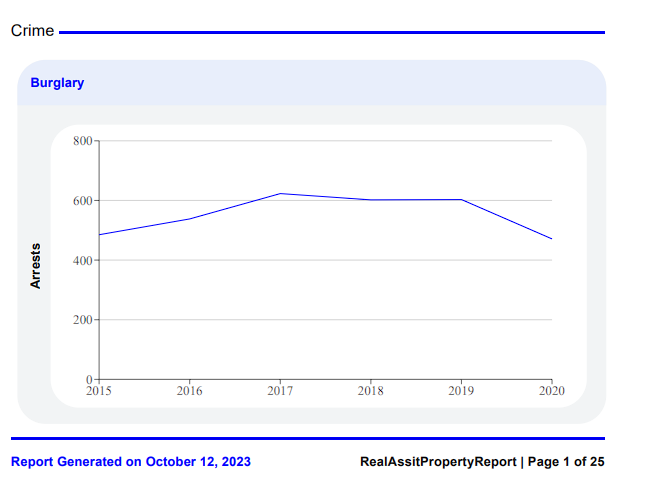

  <h3> 🖨️ <b>Graph PDF Generator</b>🖨️</h3>

# 📗 Table of Contents

- [📖 About the Project](#about-project)
  - [:camera: project screenshot](#screen-shoot)
  - [🛠 Built With](#built-with)
    - [Tech Stack](#tech-stack)
    - [Key Features](#key-features)
  - [🚀 Live Demo](#live-demo)
- [💻 Getting Started](#getting-started)
  - [Setup](#setup)
  - [Prerequisites](#prerequisites)
  - [Install](#install)
  - [Usage](#usage)
- [👥 Authors](#authors)
- [🔭 Future Features](#future-features)
- [🤝 Contributing](#contributing)
- [⭐️ Show your support](#support)
- [📝 License](#license)

# 🖨️ Graph PDF Generator

 
This repository is designed for visualizing various graphs and also includes a printing feature. It is built using React, Redux, and Material-UI (MUI).

## 📷 project screenshot 

## 🛠 Built With 

### Tech Stack 

> React, Redux toolkit, MUI, axios

### Key Features 

- 
 had Printing feature 

- 
Print selected graph with A4 size

  
(<a href="#readme-top">back to top</a>)
<!-- LIVE DEMO -->

## 🚀 Live Demo 

- <a href="https://student-enrollment.onrender.com/">Live Link</a>

(<a href="#readme-top">back to top</a>)

## 💻 Getting Started 

to run on your localhost clone the project to local folder

> 
cd graph_pdf_genenrator

> 
npm i

> 
 npm start

### Setup

> 
 git clone https://github.com/zewdu444/graph_pdf_genenrator.git

> cd graph_pdf_genenrator

(<a href="#readme-top">back to top</a>)

### Prerequisites

In order to run this project you need:

- latest web-browser
- node.js and npm

### Install

To install this project in your local machine use

> 
 npm i 

> npm run build

### Usage

To run the project, execute the following command:

> 
 Open terminal on the same directory of project 

> 
 write "npm start"

> 
 open http://localhost:3000/ in browser 

## 👥 Authors 

👤 **zewdu erkyhun**

- GitHub: [@zewdu444](https://github.com/zewdu444)
- Twitter: [@zewdu444](https://twitter.com/zewdu444)
- LinkedIn: [zewdu-anley](https://www.linkedin.com/in/zewdu-anley/)

## 🔭 Future Features 

> Home page with different graphs

## 🤝 Contributing 

Contributions, issues, and feature requests are welcome!

Feel free to check the [issues page](https://github.com/zewdu444/graph_pdf_genenrator/issues).

(<a href="#readme-top">back to top</a>)

## ⭐️ Show your support 

> If you like the project please give it star

(<a href="#readme-top">back to top</a>)

(<a href="#readme-top">back to top</a>)

## 📝 License 

This project is [MIT](./LICENSE) licensed.

(<a href="#readme-top">back to top</a>)

